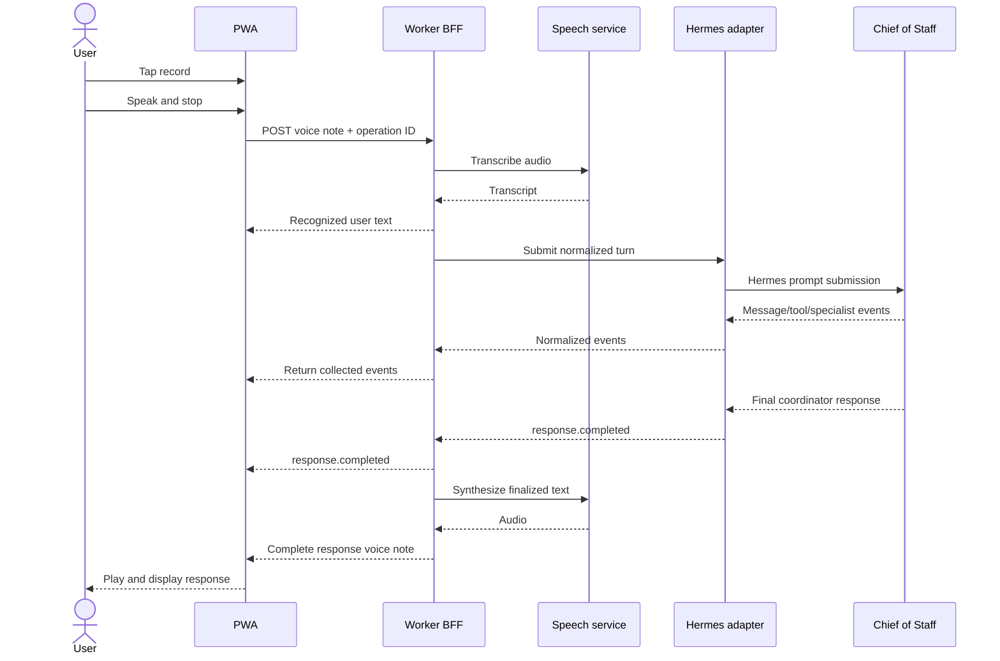

# Communication flow

## Interaction model

STTS uses asynchronous, half-duplex voice notes rather than a continuous live call. One user recording becomes one submitted turn. One finalized coordinator response becomes one replayable synthesized note.

The text transcript may update while an agent run is active. Audio synthesis begins only after the coordinator-facing response is final.

## Primary round trip



The BFF may combine transcription and turn submission behind one client command or expose them as two phases. Regardless of endpoint shape, the user message is not considered accepted by the agent stack until an explicit `turn.accepted` event exists.

## Turn state machine

```text
idle
  └─ record ─> recording
recording
  ├─ stop ───> recorded
  └─ discard -> idle
recorded
  ├─ submit ─> transcribing
  └─ discard -> idle
transcribing
  ├─ success -> review | submitting
  └─ failure -> transcription_failed
review
  ├─ submit ─> submitting
  ├─ edit ───> review
  └─ discard -> idle
submitting
  ├─ accepted -> responding
  └─ failure  -> submission_failed
responding
  ├─ final ──> synthesizing
  ├─ clarify -> awaiting_clarification
  ├─ approve -> awaiting_approval
  ├─ cancel ─> interrupting
  └─ failure -> response_failed
synthesizing
  ├─ success -> ready
  └─ failure -> synthesis_failed
ready
  ├─ play ───> playing
  └─ record ─> recording
playing
  ├─ ended ──> ready
  ├─ stop ───> ready
  └─ record ─> recording
```

Failure states retain enough state to retry only the failed phase. For example, synthesis retry does not rerun the agent.

## Streaming presentation

The transcript model is event-driven. The current preview returns each collected turn as one bounded HTTP response; resumable browser streaming remains roadmap work.

- User text appears after transcription and is marked pending until agent acceptance.
- Coordinator text can appear progressively.
- Specialist and tool activity appears as labeled, collapsible activity.
- Only finalized coordinator-facing text is sent to TTS.
- Internal reasoning is never requested or displayed.

Ordering uses the server-issued event cursor. The client may optimistically render local capture state, but it reconciles conversation content from authoritative server events.

## Clarification flow

1. Hermes pauses and emits a clarification request.
2. The adapter emits `input.requested` with kind `clarification`.
3. The app stops any response playback and presents the concise question.
4. The user answers by voice or text.
5. The app submits the answer against the request ID, not as an unrelated turn.
6. Hermes resumes the same run where supported; otherwise the adapter preserves equivalent context.

An expired request cannot be answered. The app refreshes conversation state and explains the operational error concisely.

## Approval flow

Approvals are bound to a specific request, proposed action, and expiry.

```text
approval requested
  -> user proposes approve/deny
  -> app reads back action and interpreted choice
  -> user explicitly confirms
  -> BFF validates identity, request status, and confirmation nonce
  -> adapter approves or denies upstream
```

Rules:

- Silence, uncertainty, interruption, timeout, or recognition below the configured threshold cannot approve.
- A voice “yes” without a live confirmation nonce cannot approve.
- Denial may be immediate; approval requires read-back confirmation.
- The confirmation screen offers explicit approve and deny controls.
- The event log records the decision, not source audio.

## Interruption flow

Playback and execution are separate:

- **Stop playback** affects only local audio.
- **Interrupt run** sends a session-level cancellation command correlated to the active client operation.
- **Redirect** interrupts an active run, waits for cancellation acknowledgement or a bounded timeout, and then submits the new turn with explicit relation to the interrupted run.

When the user records while audio is playing, local playback stops immediately. Agent work is interrupted only if it is still active.

## Reconnection and replay

This section defines the target reconnection flow. The preview checkpoints Hermes replay sequence numbers before each resumed command and rejects stale events, but browser event-stream resume and transcript hydration are not yet implemented.

1. The client reconnects with conversation ID and last applied cursor.
2. The BFF validates access again.
3. The adapter requests events after the cursor where Hermes supports replay.
4. If direct replay is unavailable, the adapter reconstructs normalized state from authoritative Hermes history and sends a snapshot followed by live events.
5. The client deduplicates by event ID and applies events in cursor order.

The client never resubmits a turn merely because the event connection dropped.

## Retry semantics

These are target semantics. The preview does not automatically retry agent commands; durable operation-ID deduplication remains roadmap work.

| Failure | Retry unit | Idempotency key |
|---|---|---|
| Audio upload/STT | transcription operation | voice-note operation ID |
| Turn submission before acceptance | turn | turn operation ID |
| Event connection | stream resume | conversation ID + cursor |
| TTS | finalized response | response ID + voice parameters |
| Approval/clarification answer | input request | request ID + answer operation ID |

## Audio lifecycle

Source audio lives in browser memory or temporary local state until transcription succeeds or the user discards it. The Worker streams or buffers it only within platform limits and does not persist it. Synthesized audio is cached only ephemerally in the client; final text and synthesis parameters are sufficient to regenerate it.
